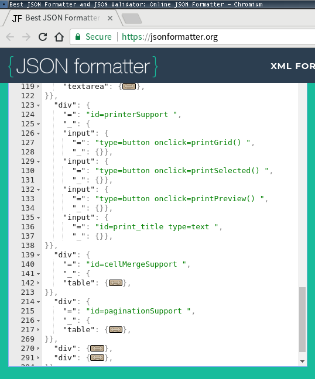

# {{.Name}}

{{render "license/shields" . "License" "MIT"}}
{{template "badge/godoc" .}}
{{template "badge/goreport" .}}
{{template "badge/travis" .}}

## {{toc 5}}

## {{.Name}} - HTML Extraction Tool

The `htmlextract` makes it easy to look at the HTML files from different aspects. 

- **`htmlextract outline`** will extract HTML structure as outline so as more easy to focus on the structure, not the details.
- **`htmlextract clean`** will clean up HTML tags & attributes as much as possible, so as to be able to go back to the plain text version as much as possible. 
- **`htmlextract h2md`** will convert HTML to .md file on top of above clean up.

# Usage

### $ {{exec "htmlextract" | color "sh"}}

### $ {{shell "htmlextract outline" | color "sh"}}

### $ {{shell "htmlextract clean" | color "sh"}}

### $ {{shell "htmlextract h2md" | color "sh"}}


# Examples

## Outline

### $ {{shell "htmlextract outline -i test/sample0.html -o" | color "json"}}

### Advantages

- By extracting HTML structure as outline, the `htmlextract outline` will make it easier analyse the file structure, which is most often needed when doing web scrapping or WebDriver code developing.
- The output is mindfully chosen as the JSON format so as to take advantage of the dynamic folder feature that the text editors provide. Or you can use the [jsonformatter.org](https://jsonformatter.org/) online as well, even without a text editors.

Here is a screenshot of viewing the result of `htmlextract outline -i test/sample2.html`:



# Download binaries

- The latest binary executables are available under  
https://github.com/go-xmlfmt/{{.Name}}/releases  
as the result of the Continuous-Integration process.
- I.e., they are built right from the source code during every git tagging commit automatically by [travis-ci](https://travis-ci.org/).
- Pick & choose the binary executable that suits your OS and its architecture. E.g., for Linux, it would most probably be the `{{.Name}}_linux_VER_amd64` file. If your OS and its architecture is not available in the download list, please let me know and I'll add it.
- You may want to rename it to a shorter name instead, e.g., `{{.Name}}`, after downloading it. 


# Debian package

Available at the above releases url as well.

# Install Source

To install the source code instead:

```
go get github.com/go-xmlfmt/htmlextract
```


## Author(s) & Contributor(s)

- [Antonio SUN](https://github.com/AntonioSun)

Powered by **[WireFrame]**(https://github.com/go-easygen/wireframe), the one-stop wire-framing solution for Go cli based projects, from start to deploy.

All patches welcome. 
